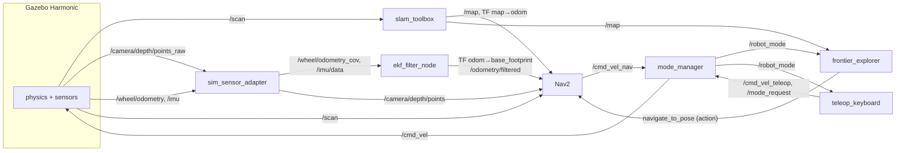
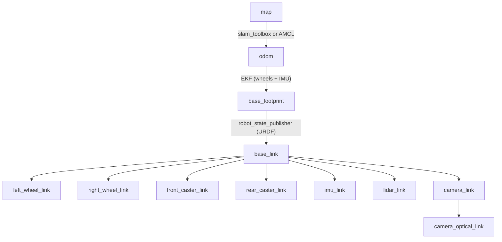

# 03 · Architecture

## Packages

| Package | Type | Responsibility |
|---|---|---|
| `rover_description` | CMake (data) | what the robot **is**: URDF/xacro, meshes, `dimensions.yaml` |
| `rover_gazebo` | CMake (data) | the **simulated world**: SDF worlds, spawning, Gazebo ↔ ROS bridge |
| `rover_navigation` | CMake (data) | **where am I, and how do I get there**: EKF, SLAM, AMCL, Nav2 configs and launch files |
| `rover_control` | Python | **custom behaviour**: teleop, mode manager, explorer, patrol example, sim adapter |
| `rover_bringup` | CMake (data) | **wiring it all together**: top-level launch files, RViz config, parameters |

Why split it like this? Each package can be reused alone. `rover_navigation` has no idea whether
it runs in Gazebo or on the real robot, and `rover_description` can be shown in RViz without
anything else. This is the standard ROS layout.

## Node graph



## Topics you should know

| Topic | Type | Publisher → Subscribers |
|---|---|---|
| `/scan` | `sensor_msgs/LaserScan` | lidar → SLAM, AMCL, costmaps, collision monitor |
| `/camera/depth/points` | `sensor_msgs/PointCloud2` | sim adapter → costmaps, collision monitor |
| `/camera/color/image_raw` | `sensor_msgs/Image` | camera → RViz (and your future perception code) |
| `/imu/data` | `sensor_msgs/Imu` | sim adapter → EKF |
| `/wheel/odometry_cov` | `nav_msgs/Odometry` | sim adapter → EKF |
| `/odometry/filtered` | `nav_msgs/Odometry` | EKF → Nav2 |
| `/map` | `nav_msgs/OccupancyGrid` | SLAM / map_server → Nav2, explorer |
| `/cmd_vel_teleop` | `geometry_msgs/Twist` | keyboard → mode manager |
| `/cmd_vel_nav` | `geometry_msgs/Twist` | Nav2 collision monitor → mode manager |
| `/cmd_vel` | `geometry_msgs/Twist` | **mode manager only** → wheels |
| `/robot_mode` | `std_msgs/String` (latched) | mode manager → everyone: `MANUAL` / `AUTO` |
| `/explore/status` | `std_msgs/String` (latched) | explorer → keyboard status line |

See the live graph yourself with `rqt_graph`, and list everything with `ros2 topic list`.

## TF tree (coordinate frames)



* **`map → odom`**: corrects the slow drift of odometry. It can *jump* when SLAM closes a loop.
* **`odom → base_footprint`**: smooth and continuous, but drifts over time. Controllers use this.
* **`base_footprint`** is on the ground under the robot centre; **`base_link`** is on the wheel axle.

This split is the ROS convention [REP-105](https://www.ros.org/reps/rep-0105.html). See it live with
`ros2 run tf2_tools view_frames` (it writes `frames.pdf`).

## The velocity chain (who is allowed to move the robot)

```
Nav2 controller ──cmd_vel_nav_raw──► velocity_smoother ──cmd_vel_smoothed──► collision_monitor ──cmd_vel_nav──┐
                                                                                                               ├─► mode_manager ──cmd_vel──► wheels
teleop_keyboard ──cmd_vel_teleop───────────────────────────────────────────────────────────────────────────────┘
```

Exactly **one** node (`mode_manager`) writes `/cmd_vel`. This single point of control is what makes
the manual/auto switch safe and simple. See [08 Manual and auto modes](08_manual_and_auto_modes.md).

## Launch file hierarchy

```
rover_bringup/sim.launch.py                   ← what you run for simulation
├── rover_gazebo/sim.launch.py                   Gazebo + spawn + bridge + robot_state_publisher
├── rover_control sim_sensor_adapter             (node)
└── rover_bringup/autonomy.launch.py          ← shared with the real robot
    ├── rover_navigation/ekf.launch.py
    ├── rover_navigation/slam.launch.py          (if slam:=true)
    ├── rover_navigation/localization.launch.py  (if slam:=false: map_server + AMCL)
    ├── rover_control mode_manager               (node)
    ├── rviz2                                    (if rviz:=true)
    └── after 3 s: rover_navigation/navigation.launch.py (Nav2) + frontier_explorer

rover_bringup/robot.launch.py                 ← what you run on the real robot
├── robot_state_publisher, lidar driver, camera driver
└── rover_bringup/autonomy.launch.py
```

## Configuration files

| File | Controls |
|---|---|
| `rover_description/config/dimensions.yaml` | every physical dimension, mass and sensor spec |
| `rover_gazebo/config/gz_bridge.yaml` | which Gazebo topics are bridged to ROS |
| `rover_navigation/config/ekf.yaml` | sensor fusion |
| `rover_navigation/config/slam_toolbox.yaml` | mapping |
| `rover_navigation/config/nav2_params.yaml` | planning, control, costmaps, AMCL, safety |
| `rover_bringup/config/control.yaml` | mode manager, explorer, sim adapter |
