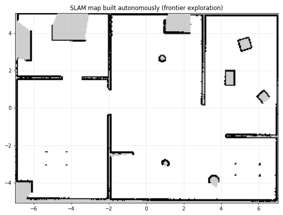

# 09 · Autonomous exploration

`frontier_explorer` (`src/rover_control/rover_control/frontier_explorer.py`) turns
"SLAM + Nav2" into a robot that maps an unknown building by itself.

## The idea

A **frontier** is where known free space meets unknown space. Driving to a frontier reveals what
lies behind it. Repeat until no frontiers are left, and the map is complete.



## The algorithm (every 1.5 s)

```
1. Wait until: exploration enabled, mode == AUTO, a map exists, TF map→robot exists, Nav2 is up.
2. Detect frontiers on the occupancy grid:
     free     = cells with 0 ≤ value < 25
     unknown  = cells with value −1
     frontier = free cells that touch an unknown cell (4-neighbourhood)
     drop frontier cells closer than `clearance` (0.30 m) to an obstacle
     group them into clusters (8-connected labelling)
     drop clusters shorter than `min_frontier_size` (0.40 m)
     goal of each cluster = its cell closest to the cluster centroid
3. If a goal is active: keep it unless
     – it timed out (90 s), or the robot made no progress for 20 s        → blacklist it
     – the robot is within 0.45 m but the area is still unknown (occluded) → blacklist it
     – the frontier was uncovered on the way                              → pick the next one now
4. Score the candidates:   cost = distance_weight · distance − size_weight · frontier_length
   (skip blacklisted ones and those closer than 0.5 m)
5. Send the cheapest one to Nav2 (navigate_to_pose), facing the unknown.
6. No candidates for 5 checks in a row → the map is complete → drive home → DONE.
```

It is implemented with NumPy and SciPy's `ndimage` (dilation, labelling, distance transform), so
each evaluation takes milliseconds even on large maps.

## Design decisions (and the bugs that led to them)

These were all discovered while testing, and they're typical of real robotics work:

| Problem seen in testing | Fix |
|---|---|
| At start-up the map is nearly empty (a single scan); the explorer found nothing and declared "done" immediately | require `done_confirmations` (5) empty evaluations in a row |
| Nav2 was still starting and **rejected** the first goal; the explorer blacklisted the only frontier | a rejection is retried after 3 s instead of blacklisted |
| A frontier behind the sofa could be approached but never seen; the robot hovered next to it for a minute | the "reached but still unknown → occluded" rule, plus a 20 s no-progress rule |
| When the explorer switched to a better frontier, Nav2 reported the old goal as *aborted*, which looked like a failure | results of superseded goals are ignored |
| Goals hugging walls were hard to reach | the `clearance` filter (distance transform on obstacles) |

## Cooperation with the rest of the system

* **Mode:** it acts only in AUTO (it subscribes to the latched `/robot_mode`). Switching to MANUAL
  makes it forget its goal (the mode manager cancels it).
* **User goals win:** it watches `/navigate_to_pose/_action/status`. Every goal it sends carries a
  UUID it generated itself, so any *other* active goal id means a person (or another program) sent
  a goal. Exploration then pauses: `PAUSED (user goal)`.
* **Enable/disable:** `/explore/enable` (`std_srvs/SetBool`), or `o` on the keyboard.
* **Status:** `/explore/status` (latched), shown in the keyboard status line.
* **Visualisation:** `/explore/frontiers` (MarkerArray): green frontier cells, blue candidate goals,
  red current target.

## Parameters (`rover_bringup/config/control.yaml`)

| Parameter | Default | Effect |
|---|---|---|
| `enabled_on_start` | true | explore as soon as AUTO is selected |
| `planner_period` | 1.5 s | how often to re-evaluate |
| `min_frontier_size` | 0.40 m | ignore tiny gaps |
| `clearance` | 0.30 m | keep goals away from walls |
| `distance_weight` / `size_weight` | 1.0 / 0.6 | nearby vs. big frontiers |
| `goal_timeout` / `stuck_timeout` | 90 / 20 s | when to give up on a goal |
| `reached_radius` | 0.45 m | "close enough; if still unknown, it's occluded" |
| `done_confirmations` | 5 | empty checks before declaring completion |
| `return_home` | true | drive back to the start when done |

**Experiment:** set `size_weight: 0.0` (always the nearest frontier) or `distance_weight: 0.2`
(prefer big frontiers), then compare the total exploration time. That is [Lab 7](10_hands_on_labs.md#lab-7--tune-the-explorer).

## Measured result

In the default world, starting from the origin in AUTO: **131 m² mapped in about 4.4 min of
simulated time**. The explorer skipped two occluded spots, returned home and reported `DONE`.
Localization error at the end: about 1 cm.

## Where to go next

* **Information gain** instead of frontier length: estimate how many unknown cells would become
  visible from a goal (ray casting) and pick the most informative, not just the biggest.
* **Travel cost from the planner**: use Nav2's `compute_path_to_pose` path length instead of
  straight-line distance (walls make straight lines misleading).
* **Multi-robot exploration**: robots share the map and avoid picking the same frontier.
