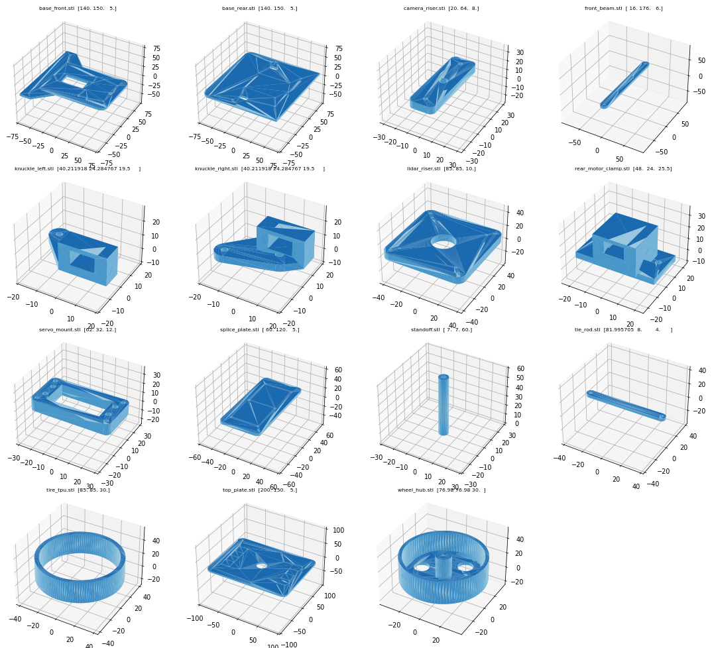
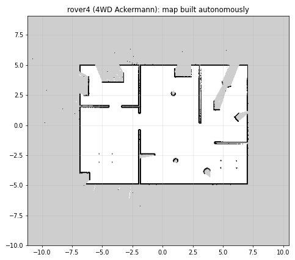

# 14 · Rover4: 4WD with Ackermann steering


Rover4 is the second robot in this repository: a **car-like** robot with **all four wheels driven**
and the **front wheels steered** by one servo. It uses a **RealSense D435i** (RGB-D + IMU) and an
**RPLIDAR S2M1** (30 m range). Everything else is shared with the 2WD rover: the autonomy stack,
mode switching, exploration, the docs and the labs. Select it with `robot:=rover4`.

```bash
./scripts/start_sim.sh robot:=rover4                    # simulation + car-mode keyboard
./scripts/start_sim.sh robot:=rover4 initial_mode:=auto # explore by itself right away
ros2 launch rover_description display.launch.py robot:=rover4   # model + steering sliders in RViz
```

## Rover vs. Rover4

| | rover (2WD) | rover4 (4WD Ackermann) |
|---|---|---|
| Drive | 2 wheels, differential | 4 wheels driven (N20 motors) |
| Steering | by wheel speed difference | front wheels, one MG996R servo |
| Turn in place | ✅ | ✖ (min. turning radius ≈ 0.35 m) |
| Size (L × W × H) | 200 × 206 × 171 mm | 285 × 250 × 179 mm |
| Wheels | Ø70 mm | Ø85 mm |
| Lidar | RPLIDAR C1 (12 m) | RPLIDAR S2M1 (30 m, DTOF) |
| Depth camera | RealSense D435 | RealSense D435i |
| IMU | separate board | the D435i's built-in BMI055 |
| Reference frame | axle centre | **rear**-axle centre |
| Global planner | Smac 2D | **Smac Hybrid-A\*** (Reeds-Shepp) |
| Controller | MPPI DiffDrive | **MPPI Ackermann** |
| Behavior tree | Nav2 default | default **without Spin** |
| Printed parts | 9 designs | 15 designs |

## Ackermann steering in 3 minutes

When a car turns, all wheels must roll around **one common centre** on the line of the rear
axle, otherwise the tires scrub sideways. That means the **inner front wheel must steer more** than
the outer one:

```
          δ_inner = atan( L / (R − k/2) )        L = wheelbase   (0.200 m)
          δ_outer = atan( L / (R + k/2) )        k = kingpin distance (0.160 m)
                                                 R = turn radius of the rear-axle centre
```

The knuckles' **steering arms point towards the rear-axle centre**. With one tie rod per side,
this linkage produces roughly this unequal angle automatically; that's the "Ackermann geometry".

A velocity command `(v, ω)` becomes a turn radius `R = v / ω`. That's why a car can't turn in place:
for `v = 0`, `R = 0`, which would need infinite steering. The steering limit (30°) gives the
minimum radius `R_min = L / tan(30°) ≈ 0.35 m`; the navigation stack uses 0.40 m for margin.

**Measured in simulation** (turning with R = 0.5 m): inner wheel **25.3°**, outer **18.9°**;
the formula above gives 25.5° and 19.0°.

## Hardware



The printable parts are generated from `src/rover_description/config/dimensions_rover4.yaml`:

```bash
python3 hardware/generate_parts.py --robot rover4 --check     # → hardware/stl/rover4/*.stl
```

The 280 mm lower deck doesn't fit a 220 mm bed, so it's printed as **two halves**, joined from
below by a **splice plate** with 6 × M3. Full parts list, BOM and assembly are in the
[hardware guide](../hardware/README.md#rover4-4wd-ackermann).

The steering chain: **MG996R servo** (shaft pointing down through the deck) → servo horn →
2 **tie rods** → **steering arms** on the 2 **knuckles**, which pivot on **M4 kingpins** in the
**front axle beam**. Each knuckle clamps an **N20 gear motor** that drives its wheel directly.

## Software: what changes for a car

**Simulation.** Gazebo's `AckermannSteering` system (in `rover4.gazebo.xacro`) takes the same
`/cmd_vel` as the 2WD rover and computes both steering angles and all four wheel speeds. It
publishes the same `/wheel/odometry`. The sensors publish the same topics too, so the
bridge, the sim adapter, the EKF, SLAM and the mode manager are **unchanged**.

**Planning: Smac Hybrid-A\*.** The 2D planner used by the rover finds paths a car can't drive
(sharp corners, turning on the spot). Hybrid-A\* searches over **(x, y, heading)** with motion
primitives that respect `minimum_turning_radius: 0.40`. With `REEDS_SHEPP` it may also reverse
(three-point turns); `reverse_penalty: 2.0` makes it prefer driving forwards.

**Control: MPPI Ackermann.** `motion_model: "Ackermann"` with
`AckermannConstraints.min_turning_r: 0.40` makes MPPI only sample trajectories the car can follow.

**Behavior tree.** Nav2's default recovery includes `Spin` (turn on the spot), which a car can't
do. `rover_navigation/behavior_trees/ackermann_*.xml` are the default trees without Spin:
clear costmaps → wait → back up. `navigation.launch.py robot:=rover4` loads them.

**Footprint.** The robot's reference point is the **rear axle** (the bicycle-model convention), so
the footprint polygon extends 0.255 m forwards and 0.055 m backwards.

**Keyboard.** `teleop_keyboard --ros-args -p ackermann:=true` (set automatically by
`start_sim.sh robot:=rover4`): `a`/`d` steer while rolling forwards; `q e z c` still work.

**Exploration.** `rover_bringup/config/control_rover4.yaml` keeps goals further from walls
(0.40 m) and from the robot (0.8 m), and allows more time per goal, because turning takes room.

All files: `nav2_params_rover4.yaml`, `control_rover4.yaml`, `rover4.urdf.xacro`,
`rover4.gazebo.xacro`, `dimensions_rover4.yaml`, `behavior_trees/ackermann_*.xml`.

## Results in simulation

| Test | rover (2WD) | rover4 (4WD Ackermann) |
|---|---|---|
| Autonomous exploration of the default world | 131 m², ≈ 4.4 min | **128 m², ≈ 8.8 min**, returned home |
| SLAM pose vs. ground truth at the end | ≈ 1 cm | **≈ 1 cm** |
| Real-time factor (headless, CPU rendering) | ≈ 0.4–0.9 | ≈ 0.85–0.9 |



Exploration takes about twice as long: every change of direction is a manoeuvre instead of a spin.

## Known limitations and things to check when building

* **Wheel odometry scrubs in turns.** In simulation, both wheels on a side turn at the same speed,
  but in a turn the front wheels travel further than the rear ones. Raw wheel odometry drifted about 26 cm
  over a 2.7 m run with a tight turn. The EKF (gyro) and SLAM correct this. On the real robot, the
  firmware can drive each wheel at its own speed (below).
* **Narrow spots.** Near walls and in 1.2 m doorways, the robot sometimes needs several attempts
  or a reverse manoeuvre. The explorer gives up on a goal after 30 s without progress and picks another.
* **The mechanical design is v1 and not test-fitted.** Check the tire clearance at full lock
  (reduce `steering.limit` if a tire rubs the beam), and the **S2M1 mounting hole pattern**
  (`lidar.mount_hole_spacing`) against the datasheet before printing.
* **The real-robot launch is a template**, as for the 2WD rover.

## Real robot: firmware for Ackermann

The driver contract is the same as for the rover ([11 Real robot](11_real_robot.md)): subscribe
`/cmd_vel`, publish `/wheel/odometry_cov` and `/joint_states`. `robot.launch.py robot:=rover4`
starts the S2M1 (1 Mbaud) and the D435i with its IMU remapped to `/imu/data`.

The microcontroller turns `(v, ω)` into servo and motor commands:

```text
if |v| < 0.01:                    steer = 0, all wheels 0            (a car cannot rotate in place)
R  = v / ω                        (turn radius of the rear-axle centre; straight if ω ≈ 0)
δ  = atan(L / R)                  → servo angle (clamp to ±30°; calibrate servo µs per degree)
rear  wheels:  v_rl = v (R − t/2)/R          v_rr = v (R + t/2)/R
front wheels:  v_fl = v √(L² + (R − t/2)²)/R  v_fr = v √(L² + (R + t/2)²)/R
                                  L = 0.200 m, t = 0.220 m, wheel radius 0.0425 m
```

Giving each wheel its own speed like this removes the tire scrub seen in the simulation. The
servo needs its **own 6 V supply** (a 5 A BEC). An MG996R draws up to 2.5 A under load and would
brown out the Raspberry Pi if they shared a regulator.

## Viewing the model

```bash
ros2 launch rover_description display.launch.py robot:=rover4   # move the steering + wheel sliders
xacro src/rover_description/urdf/rover4.urdf.xacro sim_gazebo:=false > /tmp/rover4.urdf && check_urdf /tmp/rover4.urdf
./scripts/start_sim.sh robot:=rover4 world:=empty.sdf   # drive it around an empty world
```
