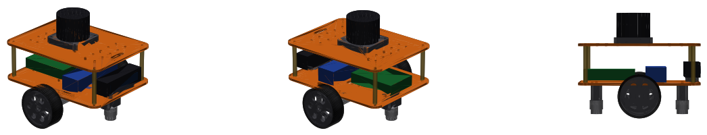
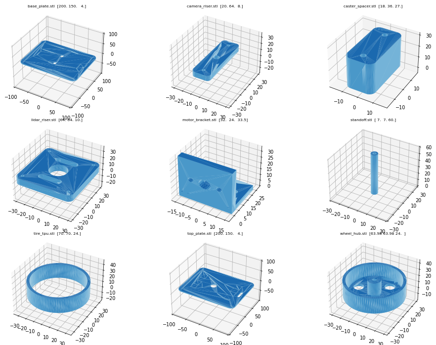

# Rover hardware: 3D-printable parts, BOM, assembly



A two-deck differential-drive robot, 200 × 206 × 171 mm, about 1 kg. Every structural part
fits a 220 × 220 mm print bed.

## Printable parts

The STL files are in `stl/`. They are generated from **`generate_parts.py`**, which reads
`../src/rover_description/config/dimensions.yaml`, the same file the URDF and
simulator use. Change a dimension there, then run:

```bash
python3 generate_parts.py --check   # regenerates stl/*.stl + sim meshes, verifies they are watertight
```



| Part | Qty | Material | Notes |
|---|---|---|---|
| `base_plate.stl` | 1 | PETG / PLA | lower deck: motor brackets, casters, Pi 5, battery straps, camera riser |
| `top_plate.stl` | 1 | PETG / PLA | upper deck: lidar riser + M3 accessory grid |
| `wheel_hub.stl` | 2 | PETG | print outer face down; D-shaft press fit (4 mm JGA25 shaft) |
| `tire_tpu.stl` | 2 | TPU 95A | stretch over the hub rim |
| `motor_bracket.stl` | 2 | PETG | L-bracket, print flange down, 40 % infill |
| `caster_spacer.stl` | 2 | PETG / PLA | raises a 3/4" ball caster to the axle plane |
| `lidar_riser.stl` | 1 | PETG / PLA | |
| `camera_riser.stl` | 1 | PETG / PLA | 1/4"-20 screw from below into the camera |
| `standoff.stl` | 4 | PETG / PLA | or M3 × 60 mm brass standoffs |

Suggested print settings: 0.2 mm layers, 4 perimeters, 30 % gyroid infill, no supports.

## Bill of materials (non-printed)

| Item | Qty | Suggested part | Used for |
|---|---|---|---|
| Single-board computer | 1 | Raspberry Pi 5 (4–8 GB) + active cooler | runs ROS 2 Jazzy (Ubuntu 24.04) |
| Microcontroller | 1 | ESP32 / Raspberry Pi Pico | motor PWM + encoder counting (micro-ROS or serial) |
| Gear motors with encoders | 2 | JGA25-370, 12 V, 280 rpm, hall encoder | drive, **wheel odometry** |
| Motor driver | 1 | TB6612FNG or DRV8833 (2-channel) | |
| 2D lidar | 1 | Slamtec RPLIDAR C1 (or A1 / LDRobot LD19) | SLAM, localization, obstacles |
| RGB-D camera | 1 | Intel RealSense D435 / Luxonis OAK-D Lite | **low obstacles** the lidar can't see, images |
| IMU | 1 | BNO055 / ICM-20948 / MPU-6050 breakout | gyro for the EKF (slip-tolerant heading) |
| Ball casters | 2 | 3/4" metal ball caster (≈25 mm tall) | measure yours → `caster.body_height` |
| Battery | 1 | 3S LiPo 2200 mAh (or 3S 18650 pack + BMS) | |
| Step-down converter | 1 | 5 V / 5 A buck (USB-C PD trigger for the Pi 5) | |
| Power switch + fuse | 1 | 10 A rocker + inline 5 A fuse | |
| Screws | – | M3 × 8/10/12, M2.5 × 6 (Pi), 1/4"-20 × 8 (camera), M3 nuts / heat inserts | |

## Assembly

1. **Motors:** bolt each JGA25 gearbox face to a `motor_bracket` wall (2 × M3 × 6, 17 mm spacing).
   Bolt the bracket flanges under the base plate (2 × M3 each, holes 10 mm either side of the centre line).
2. **Wheels:** push the `tire_tpu` onto the `wheel_hub` (warm it slightly), then press the hub onto the D-shaft.
3. **Casters:** M3 screws through the base plate → `caster_spacer` → ball caster, front and rear.
4. **Electronics (lower deck, top side):** Pi 5 on M2.5 standoffs (rear), battery with a velcro
   strap through the slots (front), IMU at the centre, motor/encoder wires through the side slots.
5. **Camera:** `camera_riser` at the front edge (2 × M3), camera on the 1/4"-20 screw, facing forward.
6. **Upper deck:** 4 standoffs, then the `top_plate`; `lidar_riser` + lidar on top (cable through the centre hole).
   Motor driver, buck converter and switch go on the accessory grid.

## Wiring overview

```
3S battery ─ fuse ─ switch ─┬─ motor driver VM ── motors
                            └─ 5 V buck ── Raspberry Pi 5 ──USB── lidar
                                                   │ ├──USB3── RGB-D camera
                                                   │ └──I2C─── IMU
                                                   └──USB/UART── ESP32 ── motor driver (PWM/DIR)
                                                                   └───── encoders (A/B)
```

The ESP32 firmware must accept `/cmd_vel` and publish wheel odometry and joint states (see the
topic contract in [Building the real robot](../docs/11_real_robot.md)).

Sensor mounting positions in the URDF: lidar scan plane about 156 mm above the ground, camera
centre about 77 mm above the ground, 88 mm forward of the axle.
