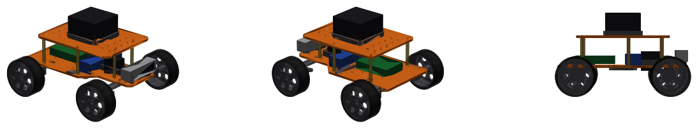

# Hardware: 3D-printable parts, BOM, assembly

Two robots: the 2WD **rover** (this first section) and the 4WD Ackermann **rover4**
([jump to rover4](#rover4-4wd-ackermann)).

## Rover (2WD differential drive)


A two-deck differential-drive robot, 200 × 206 × 171 mm, about 1 kg. Every structural part
fits a 220 × 220 mm print bed.

### Printable parts

The STL files are in `stl/`. They are generated from **`generate_parts.py`**, which reads
`../src/rover_description/config/dimensions.yaml`, the same file the URDF and
simulator use. Change a dimension there, then run:

```bash
python3 generate_parts.py --check   # regenerates stl/*.stl + sim meshes, verifies they are watertight
```


| Part | Qty | Material | Notes |
|---|---|---|---|
| `base_plate.stl` | 1 | PETG / PLA | lower deck: motor brackets, casters, Pi 5, battery straps, camera riser |
| `top_plate.stl` | 1 | PETG / PLA | upper deck: lidar riser + M3 accessory grid |
| `wheel_hub.stl` | 2 | PETG | print outer face down; D-shaft press fit (4 mm JGA25 shaft) |
| `tire_tpu.stl` | 2 | TPU 95A | stretch over the hub rim |
| `motor_bracket.stl` | 2 | PETG | L-bracket, print flange down, 40 % infill |
| `caster_spacer.stl` | 2 | PETG / PLA | raises a 3/4" ball caster to the axle plane |
| `lidar_riser.stl` | 1 | PETG / PLA | |
| `camera_riser.stl` | 1 | PETG / PLA | 1/4"-20 screw from below into the camera |
| `standoff.stl` | 4 | PETG / PLA | or M3 × 60 mm brass standoffs |

Suggested print settings: 0.2 mm layers, 4 perimeters, 30 % gyroid infill, no supports.

### Bill of materials (non-printed)

| Item | Qty | Suggested part | Used for |
|---|---|---|---|
| Single-board computer | 1 | Raspberry Pi 5 (4–8 GB) + active cooler | runs ROS 2 Jazzy (Ubuntu 24.04) |
| Microcontroller | 1 | ESP32 / Raspberry Pi Pico | motor PWM + encoder counting (micro-ROS or serial) |
| Gear motors with encoders | 2 | JGA25-370, 12 V, 280 rpm, hall encoder | drive, **wheel odometry** |
| Motor driver | 1 | TB6612FNG or DRV8833 (2-channel) | |
| 2D lidar | 1 | Slamtec RPLIDAR C1 (or A1 / LDRobot LD19) | SLAM, localization, obstacles |
| RGB-D camera | 1 | Intel RealSense D435 / Luxonis OAK-D Lite | **low obstacles** the lidar can't see, images |
| IMU | 1 | BNO055 / ICM-20948 / MPU-6050 breakout | gyro for the EKF (slip-tolerant heading) |
| Ball casters | 2 | 3/4" metal ball caster (≈25 mm tall) | measure yours → `caster.body_height` |
| Battery | 1 | 3S LiPo 2200 mAh (or 3S 18650 pack + BMS) | |
| Step-down converter | 1 | 5 V / 5 A buck (USB-C PD trigger for the Pi 5) | |
| Power switch + fuse | 1 | 10 A rocker + inline 5 A fuse | |
| Screws | – | M3 × 8/10/12, M2.5 × 6 (Pi), 1/4"-20 × 8 (camera), M3 nuts / heat inserts | |

### Assembly

1. **Motors:** bolt each JGA25 gearbox face to a `motor_bracket` wall (2 × M3 × 6, 17 mm spacing).
   Bolt the bracket flanges under the base plate (2 × M3 each, holes 10 mm either side of the centre line).
2. **Wheels:** push the `tire_tpu` onto the `wheel_hub` (warm it slightly), then press the hub onto the D-shaft.
3. **Casters:** M3 screws through the base plate → `caster_spacer` → ball caster, front and rear.
4. **Electronics (lower deck, top side):** Pi 5 on M2.5 standoffs (rear), battery with a velcro
   strap through the slots (front), IMU at the centre, motor/encoder wires through the side slots.
5. **Camera:** `camera_riser` at the front edge (2 × M3), camera on the 1/4"-20 screw, facing forward.
6. **Upper deck:** 4 standoffs, then the `top_plate`; `lidar_riser` + lidar on top (cable through the centre hole).
   Motor driver, buck converter and switch go on the accessory grid.

### Wiring overview

```
3S battery ─ fuse ─ switch ─┬─ motor driver VM ── motors
                            └─ 5 V buck ── Raspberry Pi 5 ──USB── lidar
                                                   │ ├──USB3── RGB-D camera
                                                   │ └──I2C─── IMU
                                                   └──USB/UART── ESP32 ── motor driver (PWM/DIR)
                                                                   └───── encoders (A/B)
```

The ESP32 firmware must accept `/cmd_vel` and publish wheel odometry and joint states (see the
topic contract in [Building the real robot](../docs/11_real_robot.md)).

Sensor mounting positions in the URDF: lidar scan plane about 156 mm above the ground, camera
centre about 77 mm above the ground, 88 mm forward of the axle.

---

## Rover4 (4WD Ackermann)



A car-like robot: 4 driven wheels, servo-steered front wheels, RPLIDAR S2M1 and RealSense
D435i. It measures 285 × 250 × 179 mm and weighs about 2 kg. The design and the software are
explained in [docs/14](../docs/14_rover4_ackermann.md).

```bash
python3 generate_parts.py --robot rover4 --check    # → stl/rover4/*.stl (all fit a 220 × 220 mm bed)
```

Dimensions: `../src/rover_description/config/dimensions_rover4.yaml`.

### Printable parts (`stl/rover4/`)

| Part | Qty | Material | Notes |
|---|---|---|---|
| `base_rear.stl` | 1 | PETG | lower deck, rear half: rear motor clamps, Pi 5, cable slots |
| `base_front.stl` | 1 | PETG | lower deck, front half: battery straps, servo opening, beam and camera holes |
| `splice_plate.stl` | 1 | PETG | joins the two halves from below (6 × M3) |
| `top_plate.stl` | 1 | PETG / PLA | upper deck: lidar riser, accessory grid |
| `front_beam.stl` | 1 | PETG | front axle beam with the two M4 kingpin holes; 50 % infill |
| `knuckle_left.stl` / `knuckle_right.stl` | 1 + 1 | PETG | steering knuckle: kingpin boss, steering arm, N20 clamp; 5 perimeters |
| `rear_motor_clamp.stl` | 2 | PETG | N20 clamp under the rear deck |
| `servo_mount.stl` | 1 | PETG | MG996R frame; the servo shaft points down through the deck |
| `tie_rod.stl` | 2 | PETG | servo horn → steering arm |
| `wheel_hub.stl` | 4 | PETG | outer face down; 3 mm D-shaft press fit |
| `tire_tpu.stl` | 4 | TPU 95A | |
| `lidar_riser.stl` | 1 | PETG / PLA | **check the S2M1 hole pattern** (`lidar.mount_hole_spacing`) before printing |
| `camera_riser.stl` | 1 | PETG / PLA | D435i on a 1/4"-20 screw |
| `standoff.stl` | 6 | PETG / PLA | or M3 × 60 mm brass standoffs |

### Bill of materials (non-printed)

| Item | Qty | Suggested part | Used for |
|---|---|---|---|
| Single-board computer | 1 | Raspberry Pi 5, **8 GB** + active cooler | ROS 2 Jazzy; the D435i and 30 m lidar need more CPU and memory |
| Microcontroller | 1 | ESP32 (8 encoder interrupts + servo PWM) | 4 wheel speed loops, steering, odometry |
| Gear motors with encoders | 4 | N20 / GA12-N20, 12 V, ~200 rpm, hall encoder | 4-wheel drive |
| Motor drivers | 2 | TB6612FNG (2 channels each) | |
| Steering servo | 1 | MG996R (13 kg·cm) or DS3218 (20 kg·cm), metal 25T horn | front steering |
| Servo power | 1 | 6 V / 5 A UBEC | **separate supply**: the servo would brown out the Pi |
| 2D lidar | 1 | Slamtec RPLIDAR S2M1 (DFRobot), 1 Mbaud UART + USB adapter | SLAM, obstacles, 30 m range |
| RGB-D camera + IMU | 1 | Intel RealSense D435i (USB 3) | low obstacles, images, gyro for the EKF |
| Battery | 1 | 3S LiPo 2200–3000 mAh | |
| Step-down converter | 1 | 5 V / 5 A (USB-C PD for the Pi 5) | |
| Kingpins | 2 | M4 × 25 bolt + nylock nut + 2 washers | knuckle pivots |
| Tie-rod ends | 4 | M3 ball links (or M3 shoulder screws) | steering linkage |
| Screws | – | M3 × 8/10/12, M2.5 × 6 (Pi), 1/4"-20 × 8 (camera), M3 nuts / heat inserts | |

### Assembly

1. **Deck:** place `base_rear` and `base_front` edge to edge, bolt `splice_plate` underneath (6 × M3).
2. **Rear drive:** press an N20 into each `rear_motor_clamp`, bolt the clamps under the rear half (2 × M3 each).
3. **Front axle:** bolt `front_beam` under the front half (2 × M3). Press an N20 into each knuckle,
   then fit each knuckle under a beam end with an **M4 kingpin**. Tighten until it turns freely
   without play (nylock nut).
4. **Steering:** mount the servo in `servo_mount` over the deck opening, shaft down. Centre the servo
   (1500 µs) **before** fitting the horn pointing backwards. Connect the horn to both knuckle arms with the
   `tie_rod`s. Check both wheels point straight, then turn to full lock each way: **the tires must not
   touch the beam or the deck**. If they do, reduce `steering.limit` in the YAML and in the firmware.
5. **Wheels:** tires onto hubs, hubs onto the D-shafts.
6. **Electronics:** Pi 5 (rear), battery (front, strapped), ESP32 + 2 × TB6612 + UBEC on the upper
   deck grid; D435i on `camera_riser` at the nose.
7. **Upper deck:** 6 standoffs, `top_plate`, then `lidar_riser` + S2M1.

### Wiring overview

```
3S battery ─ fuse ─ switch ─┬─ 2 × TB6612 VM ── 4 × N20 motors
                            ├─ 6 V UBEC ─────── MG996R servo  (signal from ESP32)
                            └─ 5 V buck ─────── Raspberry Pi 5 ──USB── RPLIDAR S2M1
                                                       │ └─USB3── RealSense D435i (RGB-D + IMU)
                                                       └─USB── ESP32 ── 2 × TB6612 (PWM/DIR), servo PWM
                                                                  └──── 4 × encoders (A/B)
```
